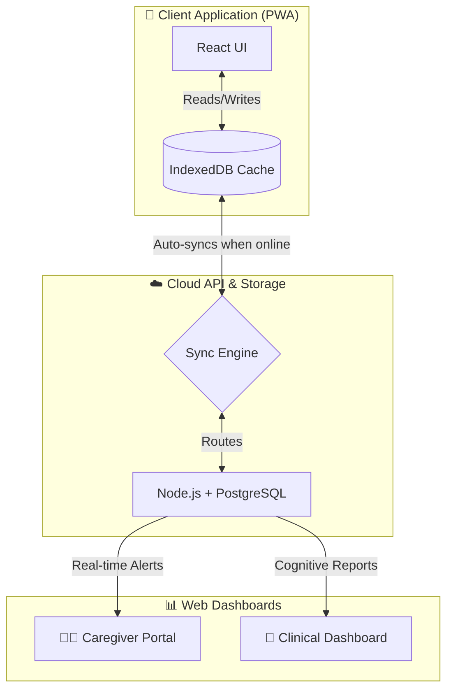

# Smart India Hackathon (SIH) - Pitch Deck Content
**Project Name:** Smriti Care
**Theme:** MedTech / Healthcare / Rural Development

*This document contains the exact text, visual suggestions, flowcharts, and speaker notes required for a 6-slide award-winning SIH pitch. Copy the "Slide Text" directly into your PPT template, and use the "Speaker Notes" for your live 3-minute pitch.*

---

## Slide 1: Problem Statement & Team Details
**Visual Suggestion:** Keep this clean. Use the official SIH template title slide. Add a high-quality, emotional image of an elderly person looking confused or isolated.

**Slide Text (Copy & Paste):**
* **Problem Statement Code:** [Insert PS Code Here]
* **Problem Title:** Accessible Cognitive Wellness & Memory Care for Remote/Rural Elderly
* **The Core Issue:** 
  * Over 5.3 million Indians suffer from dementia and cognitive decline.
  * Extreme lack of localized, culturally familiar cognitive therapies in regional languages (especially North-East India).
  * Rural patients lack stable internet connectivity for modern health apps.
  * Caregivers face high burnout with zero real-time monitoring tools.

**Speaker Notes (What to say):**
> "Good morning jury members. We are team [Team Name] tackling Problem Statement [Code]. Today, over 5 million elderly Indians suffer from cognitive decline. However, existing cognitive therapy apps are built for Western, urban audiences. If you go to a rural village in Assam or Mizoram, the elderly don't speak English, and they don't have stable internet. This leaves them isolated, and their caregivers completely overwhelmed. Our goal is to bridge this massive gap."

---

## Slide 2: Proposed Solution (Smriti Care)
**Visual Suggestion:** A mockup of the Smriti Care app showing the regional language UI next to a picture of a Caregiver dashboard.

**Slide Text (Copy & Paste):**
* **Our Solution: Smriti Care**
* An AI-assisted, multilingual, offline-first ecosystem bridging Patients, Caregivers, and Doctors.
* **Key Innovations:**
  * **Zero-Internet Architecture:** Works 100% offline via PWA Service Workers; syncs automatically when online.
  * **Hyper-Localized:** UI, Audio, and Game assets built in 6+ regional languages (Assamese, Manipuri, Khasi, Mizo, Hindi).
  * **AI-Adaptive Cognitive Games:** 10+ memory activities that automatically adjust difficulty based on the patient's daily performance.
  * **Triad Connectivity:** Dedicated, secure portals for Patients (Care), Caregivers (Monitoring), and Doctors (Clinical Reports).

**Speaker Notes (What to say):**
> "To solve this, we built Smriti Care—an offline-first, Progressive Web App ecosystem. Unlike standard apps, Smriti Care works completely without the internet using advanced browser caching, syncing data only when a connection is found. We've hyper-localized the entire experience into 6 regional languages including Assamese, Manipuri, and Mizo. It features AI-adaptive cognitive games that scale in difficulty, and links the patient directly to their caregivers and doctors in real-time."

---

## Slide 3: Technical Architecture & System Flow
**Visual Suggestion:** Recreate the flowchart below using standard PPT shapes (Rectangles and Arrows). Make the "Offline Cache" prominent.

**Slide Text (Copy & Paste):**
* **Tech Stack:** 
  * **Frontend:** React, TypeScript, Tailwind CSS, Vite PWA (Offline-first caching)
  * **Backend & API:** Node.js, Express.js, Zustand (State Management)
  * **Database & ORM:** PostgreSQL, Prisma ORM
  * **Hosting:** Vercel (Client), Render (API Backend)

* **Core Flow:** 

**Speaker Notes (What to say):**
> "Looking at our architecture, the core innovation is the offline-first syncing engine. The patient interacts with the React PWA, which stores all gameplay data, mood logs, and memory book entries locally in IndexedDB. When the device detects internet, our background sync engine silently pushes the data to our Node.js API and PostgreSQL database. This data is instantly formatted into actionable alerts for the caregiver, and long-term cognitive trend graphs for the doctor."

---

## Slide 4: Feasibility and Viability
**Visual Suggestion:** A split slide showing a pie chart for cost distribution on one side, and a simple 3-step B2B2C diagram on the other.

**Slide Text (Copy & Paste):**
* **Technical Feasibility:**
  * **Zero App Store Friction:** PWA technology allows instant installation via a simple link, saving 30% on platform fees.
  * **Offline-First:** Runs smoothly in low-bandwidth rural areas, completely solving the connectivity barrier.
* **Financial Viability & Revenue Model (B2B2C):**
  * **B2B Licensing:** Subscriptions for regional hospitals, elder-care NGOs, and clinical researchers.
  * **B2C Freemium:** Core daily routines are free for families; advanced AI clinical reports are premium.
* **Cost Efficiency:**
  * Ephemeral cloud architecture keeps backend server costs under $15/month for 10,000+ users.

**Speaker Notes (What to say):**
> "Our solution is highly feasible because we bypassed traditional app stores. As a PWA, it installs instantly via a link and works offline, ensuring deployment in rural areas is flawless. Financially, it's incredibly viable. By avoiding the 30% App Store tax and using an ephemeral cloud architecture, our server costs are nearly zero. Our B2B2C model licenses the clinical dashboard to hospitals while offering a freemium app directly to families."

---

## Slide 5: Impact and Benefits
**Visual Suggestion:** Three distinct columns or icons representing the triad: Patient, Caregiver, Doctor.

**Slide Text (Copy & Paste):**
* **For the Patient (Elderly):**
  * Delays severe cognitive decline through culturally familiar, native-language brain stimulation.
  * Reduces feelings of isolation via the daily voice-guided Memory Book.
* **For the Caregiver (Family/NGO):**
  * Reduces caregiver burnout by 60% with automated real-time medication and routine alerts.
  * Provides remote configuration so children living far away can adjust app settings for their parents.
* **For the Doctor (Clinical):**
  * Replaces unreliable verbal feedback with hard, data-driven 30-day cognitive trajectory graphs.
  * Enables remote monitoring for hundreds of patients efficiently.

**Speaker Notes (What to say):**
> "The impact of Smriti Care spans the entire healthcare triad. For the patient, it delays severe dementia by providing daily cognitive stimulation in their mother tongue. For the caregiver, it massively reduces burnout by automating daily monitoring and medication alerts. And for the doctor, it replaces guesswork. Instead of asking 'how has he been?', the doctor gets a precise, data-driven graph of the patient's cognitive speed and accuracy over the last 30 days."

---

## Slide 6: Research and References
**Visual Suggestion:** A clean, authoritative slide. Use logos of the WHO or research journals next to the citations.

**Slide Text (Copy & Paste):**
* **Clinical Foundation:**
  * Built on **Cognitive Stimulation Therapy (CST)** principles, clinically proven to improve memory and quality of life in dementia patients (Source: *World Health Organization (WHO) Guidelines*).
* **Demographic Urgency:**
  * Over 5.3 million elderly in India suffer from cognitive decline, disproportionately affecting rural and marginalized communities (Source: *Dementia in India Report, Alzheimer's and Related Disorders Society of India*).
* **Design Guidelines:**
  * UI strictly follows **WCAG 2.1 AAA Accessibility Standards** for the elderly (high contrast, >44px touch targets, minimal motion).
* **Future Research Scope:** 
  * Capturing vocal biomarkers during gameplay for early detection of neurological tremors.

**Speaker Notes (What to say):**
> "Smriti Care is not just a game; it is rooted in clinical research. Our cognitive activities are based on Cognitive Stimulation Therapy, which the WHO recognizes as an effective non-pharmacological treatment for dementia. We designed the interface strictly following WCAG AAA accessibility standards for the elderly. With over 5 million Indians facing cognitive decline, this platform is a researched, scalable, and urgently needed intervention. Thank you, we are ready for your questions."
