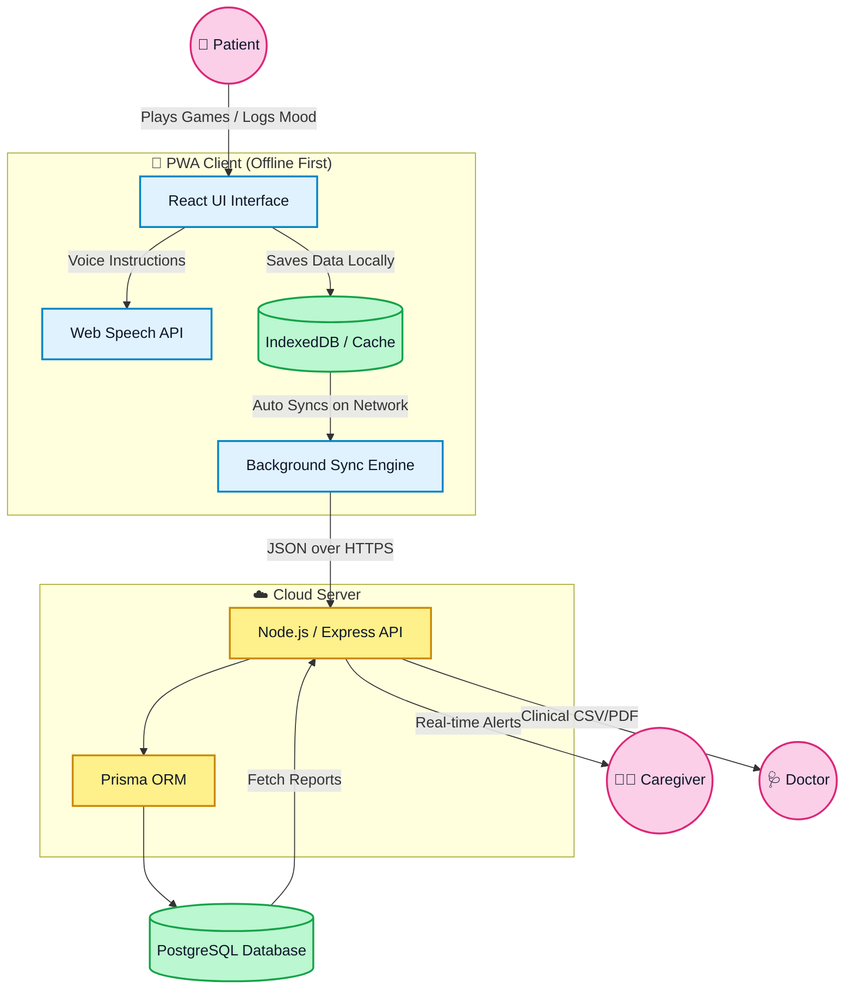

<div align="center">
  
  

  <p align="center">
    <strong>An AI-powered, offline-first cognitive wellness and memory assistance platform designed specifically for older adults.</strong>
  </p>

  <p align="center">
    
    
    
    
  </p>

  

</div>

## ✨ What the Project Does

Neuro Mind bridges the gap in mental healthcare by providing culturally familiar, native-language cognitive stimulation for users in rural and North-Eastern India (supporting **Assamese, Manipuri, Khasi, Mizo, Hindi, and English**).

The platform connects a triad of users:
- 👴 **Patients (The Elderly):** Play AI-adaptive cognitive games (Memory Match, Jigsaw, Sequence Memory), track daily routines, and log moods via a highly accessible, voice-guided Progressive Web App (PWA).
- 🧑‍⚕️ **Caregivers:** A dedicated dashboard to monitor the patient's daily activity, set medication reminders remotely, and receive real-time alerts.
- 🩺 **Doctors:** A clinical portal to view data-driven cognitive trajectory graphs and download comprehensive PDF/CSV reports, replacing guesswork with concrete metrics.

<details>
<summary><b>🌟 Highlighted Features (Click to Expand)</b></summary>
<br>

- 🚀 **Zero-Internet Architecture:** Fully functional offline. Game data and logs are cached locally using `IndexedDB` and Service Workers, auto-syncing to the cloud when internet is restored.
- 🗣️ **Deep Localization:** The UI, game assets, and Web Speech API Text-to-Speech (TTS) instructions are natively translated.
- 🧠 **AI-Adaptive Difficulty:** Games automatically scale in difficulty based on the patient's accuracy and speed.
</details>

<div align="center">
  
</div>

## 🔄 How It Works (System Architecture)

Here is a colorful flowchart showing the exact data flow and working of the application:



<div align="center">
  
</div>

## 🚀 How to Run It

This project is a monorepo containing both the `client` (React frontend) and `server` (Express backend).

### 🛠️ Prerequisites
- **Node.js** (v18+)
- **npm** or **yarn**

### 💻 Local Setup Instructions

1. **Clone the repository and install dependencies:**
   ```bash
   # This command installs dependencies for both client and server, 
   # generates the Prisma client, and seeds the local SQLite database.
   npm run setup
   ```

2. **Environment Variables:**
   - The setup uses a local SQLite database by default (`server/prisma/dev.db`).
   - If you wish to use PostgreSQL, update the `DATABASE_URL` in `server/.env` and change the provider in `server/prisma/schema.prisma`.

3. **Start the Development Servers:**
   ```bash
   npm run dev
   ```
   - ⚙️ **Backend API:** `http://localhost:3001`
   - 🎨 **Frontend App:** `http://localhost:5173`

> [!TIP]
> **Demo Accounts:** <br>
> 👴 **Patient:** `patient@demo.neuromind.in` / `Demo@1234` <br>
> 🧑‍⚕️ **Caregiver:** `caregiver@demo.neuromind.in` / `Demo@1234` <br>
> 🩺 **Doctor:** `doctor@demo.neuromind.in` / `Demo@1234` <br>
> 👑 **Admin:** `admin@demo.neuromind.in` / `Demo@1234`

<div align="center">
  
</div>

## ⛓️ Which Blockchain You Used

> [!IMPORTANT]
> **Not Applicable.** This project does *not* utilize blockchain technology. 

Given the target demographic (rural elderly populations with poor internet connectivity) and the project's primary technical constraint (**100% offline-first functionality via PWA caching**), we opted for a traditional relational database architecture (**PostgreSQL** via Prisma ORM) coupled with **IndexedDB** for local storage. 

This ensures immediate, zero-latency interactions without the need for constant network consensus or transaction fees, prioritizing high-speed data syncs when intermittent internet connections are detected.

<div align="center">
  
</div>

## ⚠️ Known Limitations

1. 🎙️ **Browser TTS Limitations:** The Text-To-Speech (TTS) feature relies on the native Web Speech API of the user's browser/OS. Voices for some regional languages (like Khasi or Mizo) may fall back to default Hindi or English accents depending on the device's installed language packs.
2. 🔑 **Offline Authentication:** While gameplay and data logging work completely offline, the *initial* login and token generation require an active internet connection.
3. 🖼️ **Asset Size:** The application contains numerous image and audio assets for the games. Initial load times (caching the PWA) may be slightly longer on 2G/3G networks before offline capabilities kick in.
4. 🔄 **Sync Conflicts:** In edge cases where multiple devices log data for the same patient offline, the last-synced timestamp overwrites previous data rather than merging complex state changes.

<br>

<div align="center">
  <i>Developed for cognitive wellness and accessible mental healthcare.</i>
</div>
