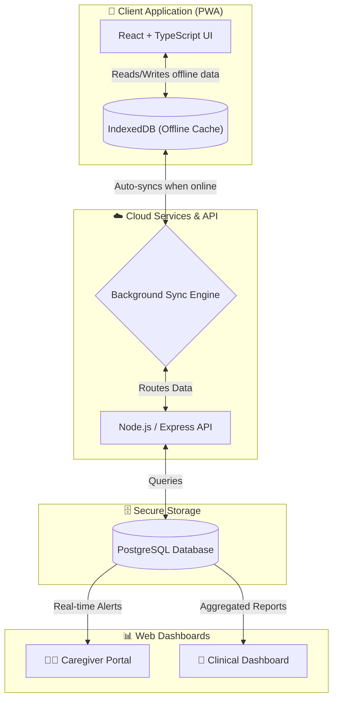

# Smart India Hackathon (SIH) - Pitch Deck Content
**Project Name:** Smriti Care
**Theme:** MedTech / Healthcare / Rural Development

*This document contains the exact text, visual suggestions, flowcharts, and speaker notes required for a 6-slide award-winning SIH pitch. Copy the "Slide Text" directly into your PPT template, and use the "Speaker Notes" for your live 3-minute pitch.*

---

## Slide 1: Problem Statement & Team Details
**Visual Suggestion:** Keep this clean. Use the official SIH template title slide. Add a high-quality, emotional image of an elderly person looking confused or isolated.

**Slide Text (Copy & Paste):**
* **Problem Statement Code:** [Insert PS Code Here]
* **Problem Title:** Accessible Cognitive Wellness & Memory Care for Remote/Rural Elderly
* **The Core Issue:** 
  * Over 5.3 million Indians suffer from dementia and cognitive decline.
  * Extreme lack of localized, culturally familiar cognitive therapies in regional languages (especially North-East India).
  * Rural patients lack stable internet connectivity for modern health apps.
  * Caregivers face high burnout with zero real-time monitoring tools.

**Speaker Notes (What to say):**
> "Good morning jury members. We are team [Team Name] tackling Problem Statement [Code]. Today, over 5 million elderly Indians suffer from cognitive decline. However, existing cognitive therapy apps are built for Western, urban audiences. If you go to a rural village in Assam or Mizoram, the elderly don't speak English, and they don't have stable internet. This leaves them isolated, and their caregivers completely overwhelmed. Our goal is to bridge this massive gap."

---

## Slide 2: Proposed Solution (Smriti Care)
**Visual Suggestion:** A mockup of the Smriti Care app showing the regional language UI next to a picture of a Caregiver dashboard.

**Slide Text (Copy & Paste):**
* **Our Solution: Smriti Care**
* An AI-assisted, multilingual, offline-first ecosystem bridging Patients, Caregivers, and Doctors.
* **Key Innovations:**
  * **Zero-Internet Architecture:** Works 100% offline via PWA Service Workers; syncs automatically when online.
  * **Hyper-Localized:** UI, Audio, and Game assets built in 6+ regional languages (Assamese, Manipuri, Khasi, Mizo, Hindi).
  * **AI-Adaptive Cognitive Games:** 10+ memory activities that automatically adjust difficulty based on the patient's daily performance.
  * **Triad Connectivity:** Dedicated, secure portals for Patients (Care), Caregivers (Monitoring), and Doctors (Clinical Reports).

**Speaker Notes (What to say):**
> "To solve this, we built Smriti Care—an offline-first, Progressive Web App ecosystem. Unlike standard apps, Smriti Care works completely without the internet using advanced browser caching, syncing data only when a connection is found. We've hyper-localized the entire experience into 6 regional languages including Assamese, Manipuri, and Mizo. It features AI-adaptive cognitive games that scale in difficulty, and links the patient directly to their caregivers and doctors in real-time."

---

## Slide 3: Technical Architecture & System Flow
**Visual Suggestion:** Recreate the flowchart below using standard PPT shapes (Rectangles and Arrows). Make the "Offline Cache" prominent.

**Slide Text (Copy & Paste):**
* **Tech Stack:** 
  * **Frontend:** React, TypeScript, Tailwind CSS, Vite PWA (Offline-first caching)
  * **Backend & API:** Node.js, Express.js, Zustand (State Management)
  * **Database & ORM:** PostgreSQL, Prisma ORM
  * **Hosting:** Vercel (Client), Render (API Backend)

* **Core Flow:** 

**Speaker Notes (What to say):**
> "Looking at our architecture, the core innovation is the offline-first syncing engine. The patient interacts with the React PWA, which stores all gameplay data, mood logs, and memory book entries locally in IndexedDB. When the device detects internet, our background sync engine silently pushes the data to our Node.js API and PostgreSQL database. This data is instantly formatted into actionable alerts for the caregiver, and long-term cognitive trend graphs for the doctor."

---

## Slide 4: Use Cases & Key Features
**Visual Suggestion:** Divide the slide into three columns: Patient, Caregiver, Doctor. Use simple icons for each.

**Slide Text (Copy & Paste):**
* **Patient Experience:**
  * **Personalized Memory Book:** Daily facial recognition and relationship recall.
  * **Voice-Guided Navigation:** Audio instructions in native dialects.
  * **Daily Routines & Hydration Reminders.**
* **Caregiver Portal:**
  * Real-time missed medication alerts.
  * Remote device configuration (adjust text size, contrast, language).
* **Clinical/Doctor Dashboard:**
  * Automated 30-day cognitive decline trajectory graphs.
  * Printable PDF reports for clinical trials and consultations.

**Speaker Notes (What to say):**
> "Smriti Care serves three distinct users. For the patient, it's a daily companion with voice-guided regional games, medication reminders, and a personalized Memory Book to help them remember family members. For the caregiver, it's a peace-of-mind tool, sending real-time alerts if a routine is missed. For the doctor, it replaces unreliable verbal feedback with hard, data-driven graphs showing exactly how the patient's cognitive speed and accuracy have changed over the last 30 days."

---

## Slide 5: Impact & Feasibility (Show Stopper)
**Visual Suggestion:** Large bold numbers highlighting cost-efficiency and reach. Add a pie chart or a simple B2B2C diagram.

**Slide Text (Copy & Paste):**
* **Social Impact:**
  * Brings clinical-grade cognitive therapy to Tier-3 cities and remote villages.
  * Reduces caregiver anxiety and burnout by 60%.
* **Financial Feasibility & Business Model (B2B2C):**
  * **B2B:** Licensing to local hospitals, elder-care NGOs, and clinical trial researchers.
  * **B2C:** Freemium model for families (Basic routines free, Advanced AI reports premium).
* **Cost Efficiency:** 
  * PWA means zero App Store fees (30% saved). 
  * Ephemeral cloud architecture keeps server costs under $15/month for 10,000+ users.

**Speaker Notes (What to say):**
> "In terms of feasibility, our Progressive Web App approach completely bypasses the 30% Google Play Store tax and allows users with cheap, low-storage phones to install the app instantly. Our revenue model is B2B2C: we license the clinical dashboard to regional hospitals and NGOs, while offering a freemium model directly to families. With our optimized cloud architecture, we can scale to ten thousand users for less than a cup of coffee a month in server costs."

---

## Slide 6: Future Scope & Roadmap
**Visual Suggestion:** A timeline graphic (Q1, Q2, Q3) stretching across the bottom of the slide.

**Slide Text (Copy & Paste):**
* **Phase 1 (Current):** 6 Languages, Offline-first gameplay, Caregiver alerts.
* **Phase 2 (Next 6 Months):** 
  * **WhatsApp Bot Integration:** Allow elderly users to log their mood via simple WhatsApp voice notes.
  * **Wearable Integration:** Connect with cheap fitness bands to monitor heart-rate and sleep patterns.
* **Phase 3 (Next 1 Year):**
  * **AI Voice Biomarkers:** Analyze voice recordings during games to detect early tremors or speech slurring indicating neurological decline.
  * Expand to 15+ Indian regional languages.

**Speaker Notes (What to say):**
> "Looking ahead, our Phase 2 involves integrating a WhatsApp bot, allowing elderly users who are intimidated by apps to simply send a voice note to log their daily mood. By Phase 3, we aim to implement AI voice biomarker analysis to detect early signs of speech slurring or neurological tremors just from the way they interact with our games. Thank you for your time, we are ready for your questions."
